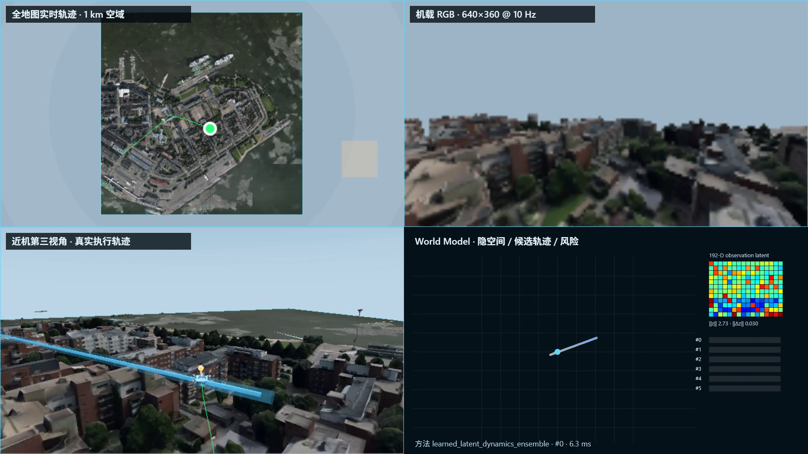

# UrbanFly：Helsinki 城市无人机数字孪生与世界模型导航系统

UrbanFly 是一套面向城市低空无人机研究的可运行数字孪生系统。项目把 Helsinki 实景三维资产、六自由度飞行动力学、RGB-D 传感器、全局与局部导航、世界模型、数据采集与质量审计，以及 Qwen API 语义协同整合到同一套工程中。



本仓库发布的是可复现的核心代码、经过验证的主模型、关键质量报告和演示入口。大体积城市资产、标准数据集与演示视频通过 GitHub Release 单独分发，避免把二进制和失败实验堆进源码历史。

## 当前已实现

- Helsinki 中心城区约 1 km 范围的实景三维数字孪生场景。
- 城市网格、地形高度、屋顶/地面语义及碰撞查询。
- 50 Hz 六自由度无人机运动学/动力学近似、姿态四元数与 yaw 状态。
- 第一视角 RGB、深度、第三人称跟随视角和全地图实时轨迹。
- 屋顶到地面、地面到屋顶、屋顶到屋顶、街谷和建筑遮挡等任务。
- 全局路线、局部目标、特权专家、动作执行记录和自动 reset。
- 世界模型隐空间状态、风险评分、预测轨迹和长程导航判定可视化。
- Qwen API 语义观察器与多无人机任务协调；发布包不包含 Qwen 权重。
- HDF5 数据集写入、独立回读、时间戳、stale action、reset 和 `.partial` 审计。
- Windows 一键安装版，以及由 GitHub Actions 原生构建的 Linux x64 开发包。
- Swarm `cf_swarm_autopilot` 跨环境 contract：五类程序化环境、2–8 UAV 与 Helsinki 使用同一 policy 输入输出边界。

## 下载与安装

请在本项目的 GitHub Releases 页面下载与系统对应的文件：

| 文件 | 用途 |
| --- | --- |
| `UrbanFly-Windows-x64-1.0.0-Setup.exe` | Windows 10/11 x64 一键安装包，内含 Helsinki 运行时城市资产 |
| `UrbanFly-Windows-x64-1.0.0-portable.zip` | Windows 免安装便携版 |
| `UrbanFly-Linux-x64-1.0.0.tar.gz` | Linux x64 原生后端与浏览器启动器 |
| `UrbanFly-HelsinkiCentral1km-Assets-v1.0.0.zip` | 独立 Helsinki 城市资产包，供开发和重新打包使用 |
| `UrbanFly-Helsinki-Dataset-v1.0.0.zip` | 经过最终 QA 的主数据集 |
| `UrbanFly-WorldModel-1km-Demo-3x.mp4` | 约 1 km、三倍速的多分镜导航演示 |

### Windows

运行安装程序，完成后从开始菜单启动“UrbanFly 数字孪生”。桌面程序会在后台启动本地仿真服务并打开成熟的数字孪生界面，不需要手工输入 `127.0.0.1` 地址。首次加载完整实景资产可能需要数秒。

便携版解压后直接运行 `UrbanFly.exe`。请保持目录结构完整，不要单独移动可执行文件。

### Linux

```bash
tar -xzf UrbanFly-Linux-x64-1.0.0.tar.gz
cd UrbanFly-Linux-x64-1.0.0
chmod +x UrbanFly
./UrbanFly
```

Linux 版本会启动原生打包的后端，并使用默认浏览器打开界面。Linux 可执行文件采用平台惯例，不使用 `.exe` 后缀。

## Qwen API 配置

UrbanFly 默认调用阿里云百炼提供的 OpenAI 兼容 API，不下载、不提交也不随 Release 分发 Qwen 原始权重。

Windows PowerShell：

```powershell
$env:URBANFLY_QWEN_API_KEY = "你的_API_Key"
$env:URBANFLY_QWEN_MODEL = "qwen-plus"
```

Linux：

```bash
export URBANFLY_QWEN_API_KEY="你的_API_Key"
export URBANFLY_QWEN_MODEL="qwen-plus"
```

也兼容 `DASHSCOPE_API_KEY`。API Key 只从环境变量读取，不会写入数据集、日志或质量报告。没有配置 Key 时，核心导航、动力学、世界模型和本地数字孪生仍可运行，只有 Qwen 语义能力不可用。

示例：

```bash
python scripts/plan_helsinki_mission_with_qwen.py --help
python scripts/run_qwen_semantic_observer.py --help
```

本地 Qwen 推理仅作为显式开发选项保留，需要手动安装 `requirements-local-qwen.txt` 并传入 `--direct-model`；它不是正式发布路径。

## 系统架构

```text
Helsinki 实景资产
  ├─ 城市网格 / 高度场 / 碰撞几何
  ├─ RGB-D 与第三人称渲染
  └─ 场景语义
          ↓
全局任务与路线 → 局部目标 / 专家策略 → 6DoF 执行器
          ↓                 ↓               ↓
      Qwen API         世界模型隐状态      状态与动作记录
          └──────────→ 风险判断 / 重规划 ←──┘
                                  ↓
                     HDF5 数据集与独立 QA
```

主要目录：

- `backend/`：仿真服务、飞行状态、传感器、规划适配器与语义 Agent。
- `frontend/`：数字孪生 Web 界面、三维场景、遥测和调试可视化。
- `desktop/`：Windows 桌面启动器与后端生命周期管理。
- `src/`：规划、控制、世界模型及数据管线核心实现。
- `scripts/`：采集、审计、演示生成、发布打包和 Qwen API 工具。
- `tests/`：后端、前端、桌面启动与数据契约回归测试。
- `models/`：体积较小且已验证的 UrbanFly 主模型；不含 Qwen 权重。
- `docs/`：架构、验收结果、发布说明和持续项目状态。

## 从源码开发

### 环境要求

- Python 3.11 或 3.12
- Node.js 20 或更新版本
- .NET 9 SDK（构建 Windows 桌面程序时需要）
- Windows 10/11 或现代 Linux x64

### 安装

```bash
python -m venv .venv
```

Windows：

```powershell
.venv\Scripts\Activate.ps1
pip install -r requirements.txt
cd frontend
npm ci
npm run build
cd ..
python -m backend.server.server
```

Linux：

```bash
source .venv/bin/activate
pip install -r requirements.txt
cd frontend && npm ci && npm run build && cd ..
python -m backend.server.server
```

开发服务默认监听本机回环地址。正式 Windows 桌面版会自动管理服务，普通用户无需接触端口。

## 关键演示

生成世界模型长程多分镜视频：

```bash
python scripts/render_world_model_long_range_demo.py --help
```

演示视频同时呈现：

1. 全地图实时运动轨迹与途经点；
2. 无人机第一视角 RGB 与深度；
3. 近距离第三人称飞行视角；
4. 世界模型预测轨迹、风险判断与隐空间状态；
5. 三倍速合成输出。

数据集检查与读回工具位于 `scripts/`，正式结果以发布包内的 manifest 和 QA JSON 为准，不以截图或日志中的目标值代替实测值。

## UrbanFly × Swarm 跨环境实验支线

UrbanFly 的系统主线始终是 **Agent 能力 + Action-Conditioned World Model + Helsinki 数字孪生闭环导航**：Agent 负责任务理解、协同、工具/API 调用和动态重规划，World Model 负责预测候选动作的未来隐状态、进展与风险，并参与在线轨迹选择。Swarm 只是跨环境实验支线，用同一个多无人机 policy 分别在 City、Open、Mountain、Village、Forest 和 Helsinki 中测试 Procedural → Realistic Digital Twin 泛化。

已完成 35/35 个“五类环境 × 2–8 UAV”原生 contract 组合、shared clue、评分和强制机间碰撞链审计。进一步使用同一套“目标分配 → policy → 预测式 World Model 重排 → 原生环境执行 → 新观测反馈”生命周期，在固定 held-out seed、每类 2 架无人机的 City/Open/Mountain/Village/Forest 中取得 **10/10 成功、0 碰撞、12,231 次闭环执行**。该结果属于显式目标可见的数字孪生模式，不冒充隐藏目标的官方 Swarm Benchmark。统一 adapter 与动态多机 imitation 网络已有聚焦测试通过；classical teacher → BC → DAgger 仅用于统一 policy 的预训练、对照与数据启动，强化学习只是可选 residual，二者都不替代 UrbanFly 的 Agent + World Model 主线。

详细状态、诚实限制与后续实验 Gate 见 [UrbanFly × Swarm 跨环境方案](docs/SWARM_CROSS_DOMAIN.md)。

## 已验证结果

当前主数据集由恰好 100 个唯一且连续的真实 Helsinki episode 组成：

- success：100/100；collision：0/100。
- stale action：0；跨 episode stale action：0。
- 自动 reset、RGB、Depth、State、Next State、commanded/executed action、Local Goal、yaw、quaternion 与 timestamp 均经过独立审计。
- HDF5 独立回读通过，损坏文件为 0，`.partial` 为 0。
- 长程世界模型演示成功到达目标地面，并保留完整飞行质量报告。
- 最新平台化 Helsinki 1 km 闭环为 1,114 步，World Model 参与 1,114/1,114 次动作重排并改变 633 次选择；4/4 语义途径点完成，0 collision、0 stale action，最终目标距离 2.634 m，四分屏 3× 视频独立回读通过。
- 低空建筑走廊 held-out 演示使用 canonical episode 095：实际高度约 10.74–15.06 m，World Model 177/177 步参与并改变 156 次动作选择，后台安全层介入 3 次，0 collision、0 stale action，2× 四分屏视频独立回读通过。

精确数值、哈希和输入目录记录在 Release manifest、主数据集 `dataset_qa.json` 及 `docs/PROJECT_STATE.md` 中。

## 边界与诚实说明

- 当前动力学是面向导航和数据生成的六自由度高频近似，不等同于 PX4 SITL 的飞控固件级闭环，也不宣称达到 AirSim 的全部气动建模精度。
- 世界模型已经进入导航判定和可视化闭环，但其泛化能力仍应在更多城市、天气和动态障碍条件下验证。
- Qwen 用于高层语义理解、任务解释与多机协调，不直接替代安全关键的低层飞控。
- Helsinki 城市资产的许可证与署名要求见 `THIRD_PARTY_NOTICES.md`。

## 发布与贡献

Windows 本地发布：

```powershell
powershell -ExecutionPolicy Bypass -File scripts/build_release_windows.ps1 -Version 1.0.0
```

Linux 包由 `.github/workflows/build-linux-release.yml` 在 Ubuntu 上原生构建。提交代码前请运行相关 Python、前端和桌面回归测试。详细要求见 `CONTRIBUTING.md`。

## 许可证

UrbanFly 源代码采用 MIT License。Helsinki 城市资产及其他第三方组件保留各自许可证，详见 `THIRD_PARTY_NOTICES.md`。
