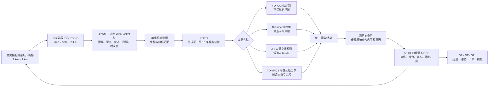
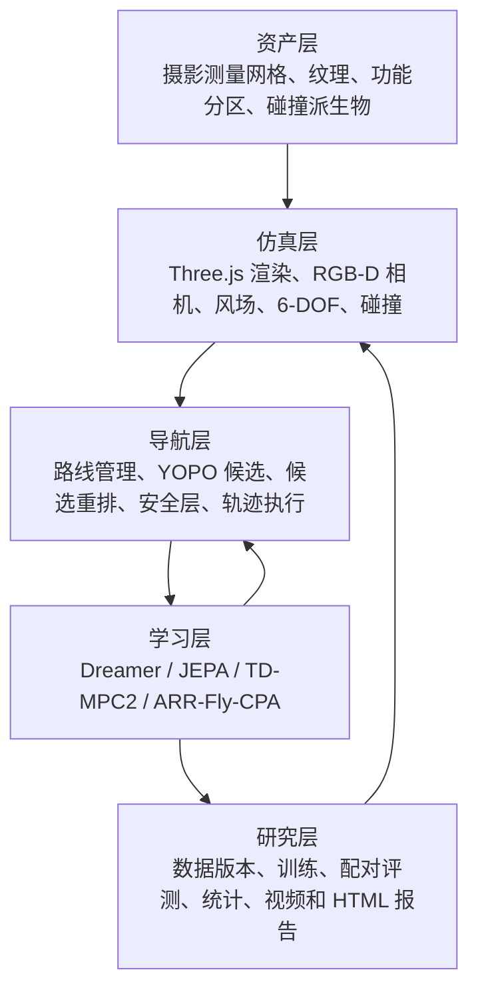
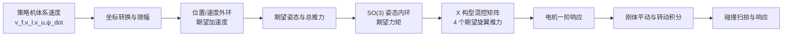

# UrbanFly 项目级技术说明：真实城市数字孪生中的单机世界模型辅助飞行

版本：2026-07-31

适用范围：UrbanFly 当前“单架无人机、真实摄影测量城市、RGB-D 感知、六自由度动力学、世界模型辅助局部规划”研究主线

配套进展记录：[月末单机世界模型进展](month_end_single_uav_world_model_progress_20260731.md)

---

## 0. 先读这一页：项目究竟做到了什么

UrbanFly 当前研究问题可以概括为：

> 在一个视觉上接近真实城市、几何上具有可查询碰撞表面的 1 km × 1 km 数字孪生场景中，让一架四旋翼仅根据机载 RGB-D、机体状态和坐标目标，以 5 Hz 选择短时域飞行动作，并由 50 Hz 六自由度动力学控制器真实执行；比较纯端到端局部规划与 Dreamer、JEPA、TD-MPC2 三类世界模型辅助规划对导航成功率、导航误差和路径效率的影响。

当前已经打通的真实闭环是：



需要坦诚区分三种状态：

| 状态 | 含义 | 当前内容 |
|---|---|---|
| 已实现并通过接口测试 | 代码链路存在，能够运行并落盘 | 城市网格、RGB-D、WebSocket、单机 6-DOF、YOPO 15 候选、三种辅助模块接口、数据 v2、SR/NE/SPL |
| 工程冒烟通过 | 只证明模块能连接，不代表算法有效 | 四种方法各完成 1 个决策步的真实城市闭环；48 帧城市数据训练 TD-MPC2 300 步 |
| 尚未形成研究结论 | 数据量、训练或正式评测不足 | 10 万帧快速集、正式城市训练、120 条配对评测、未见瓦片泛化、动态障碍和多种子主表 |

因此，当前最准确的表述不是“世界模型已经优于基线”，而是：

> UrbanFly 已经具备进行公平、可审计单机世界模型辅助飞行对比实验所需的主要工程接口；正式数据采集、同域训练和统计评测仍需完成。

---

## 1. 项目边界与研究假设

### 1.1 当前只研究单机

UrbanFly 仓库最初包含多无人机任务分配、通信约束、CBBA、拍卖和全局调度等模块。当前世界模型论文主线主动把这些因素冻结，只保留一架无人机，原因是：

1. 多机协同会把任务分配、通信、避碰和感知误差同时引入；
2. 一旦成功率变化，很难判断收益来自世界模型还是来自调度策略；
3. 单机可以先把“看见什么、预测什么、为什么选这条轨迹、实际如何执行”完整闭环做实；
4. 单机结论稳定后，再把动态无人机作为外部运动障碍加入，比直接研究多机联合策略更容易归因。

仓库中多机代码仍然保留，但它不进入当前月末四方法主表。

### 1.2 世界模型不直接控制电机

策略动作定义为机体系连续速度指令：

$$
a_t =
[v_f,\;v_l,\;v_u,\;\dot\psi]
$$

分别表示前向速度、左向速度、向上速度和偏航角速度。归一化动作位于 $[-1,1]^4$，物理限幅为：

| 分量 | 物理范围 |
|---|---:|
| 前向速度 | ±6 m/s |
| 横向速度 | ±6 m/s |
| 垂直速度 | ±3 m/s |
| 偏航角速度 | ±60°/s |

世界模型和规划器都不输出四电机转速。动作交给 50 Hz 的位置/速度外环、SO(3) 姿态内环和电机模型执行。这样既保留真实动力学影响，也避免在研究早期把感知规划问题与低层飞控学习混在一起。

### 1.3 本月对比的是“同一个规划器是否得到世界模型帮助”

当前主对照不是四套彼此完全不同的控制系统，而是：

| 方法 | 候选轨迹来源 | 最终选轨依据 |
|---|---|---|
| YOPO | 同一 YOPO、同一 RGB-D、同一 15 候选 | YOPO 原始代价最小 |
| YOPO + Dreamer | 同上 | YOPO 代价 + RSSM 未来风险/进度/间距/不确定度 |
| YOPO + JEPA | 同上 | YOPO 代价 + 潜空间未来风险/进度/间距/不确定度 |
| YOPO + TD-MPC2 | 同上 | 同一候选转为连续动作序列后，以潜空间回报、风险和终值重排 |

这个设计牺牲了“每个模型都使用其最强原生 actor”的自由度，却显著提高了公平性：四种方法看到相同观察、相同全局路线、相同候选和相同控制器，差别主要集中在“能否更准确地判断候选轨迹的未来后果”。

---

## 2. 项目分层架构

### 2.1 五层结构



### 2.2 仓库中的主要责任边界

| 路径 | 责任 |
|---|---|
| `data/helsinki_mesh/HelsinkiCentral1km/` | 真实摄影测量视觉网格、碰撞派生物、ESDF 切片和功能分区 |
| `frontend/src/digital_twin.js` | 城市 GLB 渐进加载、纹理渲染、碰撞诊断层和功能分区显示 |
| `frontend/src/drone_sensors.js` | 同光心 RGB/DepthPerspective 采集、预览、编码和 UFWM 数据包 |
| `backend/engine/multirotor_dynamics.py` | 四旋翼六自由度动力学和低层控制 |
| `backend/engine/collision.py` | 高度场、稀疏表面体素、全局 ESDF、局部 ESDF 缓存和扫掠碰撞 |
| `backend/engine/simulator.py` | 仿真时钟、外部策略动作、透明后端安全裁剪和真实碰撞响应 |
| `backend/server/` | WebSocket 协议、状态发布、策略 episode 配置和传感器转发 |
| `uav_wm_navigation/src/.../simulators/` | 提供 UrbanFly WebSocket 与 Mock 导航接口 |
| `uav_wm_navigation/src/.../planners/` | YOPO 观察预处理、候选生成和五次多项式轨迹 |
| `uav_wm_navigation/src/.../world_models/` | Dreamer、JEPA、TD-MPC2、推理运行时和统一输出 |
| `uav_wm_navigation/src/.../data/` | 数据同步、标签、WebDataset/HDF5 数据集和审计 |
| `uav_wm_navigation/src/.../evaluation/` | SR/NE/SPL、置信区间、可视化和 HTML 报告 |
| `uav_wm_navigation/configs/` | 数据、模型、模拟器和正式评测的版本化配置 |

### 2.3 为什么把浏览器渲染和 Python 学习进程分开

真实摄影测量网格和 Three.js 渲染最适合留在浏览器；PyTorch/JAX 模型和数据工具最适合留在独立 Python 进程。两者通过二进制 WebSocket 连接：

- 浏览器只负责真实可见图像和深度；
- 后端只负责权威物理状态、碰撞和仿真时钟；
- 学习进程只接收策略允许看到的数据；
- 任何一个模型超时都不会被隐藏的几何规划器悄悄替代，而是记录回退或悬停原因。

这种拆分也为未来将浏览器渲染节点与 4×A100 训练节点分离提供了接口基础。

---

## 3. 真实城市数字孪生

### 3.1 数据来源与许可证

当前场景资产来自 2017 年城市摄影测量三角网格。内部源目录保留原始数据名称以满足许可证和可追溯性，用户界面统一显示“城市”或 `CityCentral1km`。

| 属性 | 当前值 |
|---|---|
| 数据标题 | Helsinki 3D+ photogrammetric mesh (2017) |
| 许可证 | CC BY 4.0 |
| 源坐标参考 | EPSG:3879+5773 |
| 原始瓦片 | 16 个 250 m 瓦片 |
| 运行范围 | 1000 m × 1000 m |
| 本地中心 | 原坐标 `[8500, 4750]` |
| 本地轴 | X 向东，Y 向上，负 Z 向北 |

许可证署名和源信息保存在场景清单中，不能因为界面改名为“城市”而删除。

### 3.2 从零碎 OBJ 到可实时加载的场景

原始下载目录包含很多 OBJ、MTL 和纹理文件，不能简单把整个目录一次性塞进浏览器。当前资产管线将它们转换为：

| 层级 | 用途 | 三角面 | 大小 |
|---|---|---:|---:|
| L21 细节视觉层 | 近景真实渲染 | 3,825,064 | 84,270,388 B，约 80.4 MiB |
| L18 概览视觉层 | 首屏和远景占位 | 307,980 | 9,774,616 B，约 9.3 MiB |
| L18 碰撞网格 | 几何诊断/BVH 资产 | 307,980 | 2,144,708 B，约 2.0 MiB |

主要压缩和流式策略：

1. OBJ/MTL/纹理被封装成 glTF 2.0 二进制 GLB；
2. 几何使用 `EXT_meshopt_compression`；
3. 场景按 16 个 250 m 瓦片保留空间分块；
4. 首先加载全部 L18 概览瓦片，让用户快速看到完整城市；
5. 再按离视点或场景中心的距离加载 L21 细节瓦片；
6. 每次瓦片加载之间主动把控制权交还主线程，减少长任务卡顿；
7. 细节瓦片到位后释放对应概览瓦片，避免重复占用显存；
8. 关闭大规模摄影测量网格的实时阴影，保留视锥裁剪和纹理各向异性过滤。

这里的压缩只改变传输和存储形式，不修改原始数据的许可信息，也不把训练图像压缩等同于城市几何压缩。

### 3.3 为什么不再把 3DGS 作为物理世界

3D Gaussian Splatting 很适合新视角合成，但其基本元素是带外观参数的高斯，不是封闭、稳定、易于做刚体碰撞的三角表面。若直接拿 3DGS 作为飞行世界，会遇到：

- 视觉密度不等于实体表面；
- 透明度阈值会改变“哪里算墙”；
- 浮点和离群高斯会制造幽灵障碍；
- 难以得到稳定法向、穿透深度和连续碰撞响应；
- 用另一套代理碰撞体会产生“看见的楼”和“撞到的楼”不一致。

因此当前工程选择是：

> 三角网格作为视觉与几何的共同来源；高度场、BVH、体素和 ESDF 都从同一网格派生。3DGS 最多只能作为额外渲染层，不能再作为权威碰撞几何。

### 3.4 视觉真实不等于物理完全真实

当前城市的真实性边界必须明确：

- 它是真实摄影测量表面，不是程序化方块城市；
- 建筑轮廓、屋顶、街道、树木和表面纹理具有真实空间关联；
- 它不是实时更新的城市，也不包含建筑内部；
- 2017 年之后的城市变化不会自动反映；
- 摄影测量孔洞、粘连和非闭合三角面仍然存在；
- 车辆、行人和天气是仿真叠加，不来自该静态摄影测量时刻。

论文中应称为“真实摄影测量城市仿真”，不能称为“真实无人机实验”或“完整现实世界复制”。

---

## 4. 几何碰撞与空间表示

### 4.1 当前城市碰撞场究竟有多密

当前 1 km 场景不是 5 m 碰撞栅格。真正用于当前城市后端的权威静态碰撞场是：

- 由同源 L18 三角网格栅格化；
- 水平分辨率 0.5 m；
- 数组大小 2001 × 2001；
- 高度范围约 -2.08 m 到 46.12 m；
- 每个 X/Z 单元保存最高摄影测量表面；
- 每个物理步对无人机前一位置到新位置做扫掠检查；
- 默认扫掠采样步长不大于 0.25 m。

“5 m”只应出现在早期任务调度或代价层中，不能被当作无人机碰撞地图。局部飞行碰撞若使用 5 m 网格，确实无法表达街巷、树冠和建筑边缘。

### 4.2 高度场的查询方式

对无人机位置 $p=[x,y,z]$ 和安全半径 $r$：

1. 将 $x,z$ 映射到 0.5 m 高度图单元；
2. 在半径 $r$ 对应的邻域中取最高表面 $h_{\max}$；
3. 定义垂直净空：

$$
c(p,r)=y-h_{\max}(x,z,r)
$$

4. 若 $c(p,r)<r$，则认为机体与保守表面相交。

轨迹段 $p_0\rightarrow p_1$ 不只检查终点，而是在不超过 0.25 m 的间隔上采样：

$$
c_{\min}=\min_{\alpha\in[0,1]} c((1-\alpha)p_0+\alpha p_1,r)
$$

这可以避免高速飞行一步越过薄障碍物，即常说的“隧穿”问题。

### 4.3 三角网格 BVH

场景还包含约 30.8 万三角面的 L18 碰撞 GLB。前端在诊断模式下用 `three-mesh-bvh` 为几何建立包围体层次结构，支持：

- 射线与城市表面的最近交点；
- 球体与三角面的相交；
- 碰撞几何和视觉网格叠加检查；
- 20/30/40 m 等高度切片可视化。

但要特别说明：当前默认 Python 后端对该城市真正执行的是 0.5 m 保守高度表面，不是浏览器 BVH。BVH 目前主要用于几何诊断和后续升级准备。

### 4.4 已有但未默认启用的 3D 碰撞层

`backend/engine/collision.py` 还实现了另一套适用于局部高保真碰撞的层次结构：

1. `SparseStaticCollisionMap`：0.25 m 稀疏表面体素，使用 `cKDTree` 查询最近表面；
2. `DenseSignedDistanceField`：较低分辨率全局有符号距离场，三线性插值；
3. `RuntimeLocalESDFTileCache`：按需构造 16³ 个 0.25 m 单元的局部块；
4. `HierarchicalStaticCollisionMap`：取全局 ESDF 与局部精细表面的更保守距离。

局部缓存若最多保留 256 个块，float16 距离只约占：

$$
256\times16^3\times2\ \mathrm{bytes}\approx2.1\ \mathrm{MB}
$$

相比为整个 1 km 城市建立 0.25 m 三维稠密距离场，这种按需缓存能节省数量级上的内存。

### 4.5 当前碰撞场的缺陷与升级原则

高度场适合建筑屋顶和外立面安全避碰，但它把每个 X/Z 柱子中最高表面以下都视为实体。因此：

- 天桥下方会被错误封闭；
- 挑檐、拱洞、可穿行连廊无法正确表达；
- 同一垂直柱内多个分离表面无法保留；
- 树冠下方可能被保守地判为不可飞。

下一版几何保真升级应按以下优先级进行：

1. 后端直接加载同源 L18 碰撞三角网格并构建本地 BVH；
2. 用球体或胶囊体对三角网格做连续扫掠；
3. 将 0.5 m 高度场保留为全局快速拒绝层；
4. 在近机体区域启用 0.25 m 局部 3D ESDF；
5. 对视觉网格、BVH、高度场和 ESDF 做相同坐标点的自动对齐审计。

这样才能同时兼顾“整城快速查询”和“局部真实几何”。

---

## 5. 坐标系、时间和同步

### 5.1 三个必须区分的坐标系

| 坐标系 | 记法 | 分量语义 | 使用位置 |
|---|---|---|---|
| UrbanFly/Three.js 世界系 | `[x, up, z]` | X 水平、Y 向上、Z 水平 | 浏览器、后端动力学 |
| 导航工程系 | `[x, y, up]`，代码名 NWU | 将浏览器 X/Z 平面映射为导航水平平面 | YOPO、路线、评测 |
| 机体系 FLU | `[forward, left, up]` | 前、左、上 | 策略观察和动作 |

当前适配器的世界系到导航系变换是简单轴置换：

$$
[x,u,z]_{\mathrm{UrbanFly}}
\longleftrightarrow
[x,z,u]_{\mathrm{nav}}
$$

代码沿用 `NWU` 名称，但研究报告不应在没有额外地理方位标定时把第二个水平轴强行解释为严格地理“西”。更稳妥的说法是“Z-up 导航工程坐标系”。

机体系与导航世界系通过当前偏航角 $\psi$ 转换：

$$
\begin{bmatrix}
v_x\\v_y
\end{bmatrix}
=
\begin{bmatrix}
\cos\psi&-\sin\psi\\
\sin\psi& \cos\psi
\end{bmatrix}
\begin{bmatrix}
v_f\\v_l
\end{bmatrix}
$$

### 5.2 三层频率

| 环节 | 频率 | 时间步 |
|---|---:|---:|
| 刚体和电机动力学 | 50 Hz | 0.02 s |
| RGB-D 与状态采集 | 10 Hz | 0.10 s |
| 世界模型/策略决策 | 5 Hz | 0.20 s |

每个策略动作保持 10 个物理步，期间产生 2 帧传感器观察。这样可以在不让世界模型以 50 Hz 重推理的情况下，让动力学仍以较细时间步积分。

### 5.3 step 级同步原则

每个策略样本必须同时具有：

- `episode_id`；
- 连续递增的 `step_id`；
- 严格递增的 `sim_time`；
- `sensor_timestamp`；
- `state_timestamp`；
- 与该观察对应的上一动作；
- 当前步骤的原始动作和实际执行动作。

`WorldModelObservation` 会拒绝传感器和状态时间差超过 110 ms 的样本。正式数据审计还应统计：

- 时间偏差 P50/P95/最大值；
- 重复 step；
- step 跳号；
- 图像损坏；
- 深度无有效像素；
- episode 之间状态或上一动作泄漏。

---

## 6. RGB-D 机载传感器

### 6.1 相机参数

当前 `front_center` 相机提供 UrbanFly 机载 RGB-D：

| 参数 | 当前值 |
|---|---:|
| 安装位置 | 机体 `[1.05, 0.02, 0.0]` m |
| 安装姿态 | roll 0°，pitch -8°，yaw 0° |
| 分辨率 | 640 × 360 |
| 水平视场角 | 90° |
| 近平面 | 0.3 m |
| 远平面 | 120 m |
| 帧率 | 10 Hz |
| RGB 类型 | Scene |
| 深度类型 | DepthPerspective，单位 m |
| 云台稳定 | 关闭 |

关闭云台稳定意味着相机真实跟随机体滚转、俯仰和偏航。模型必须学习或利用重力方向与角速度消除姿态扰动，而不是看到一个永远水平的理想相机。

### 6.2 同光心采集

RGB 和深度使用同一个 Three.js 相机姿态、同一个曝光时刻和同一组内参。采集流程为：

1. 从无人机刚体姿态计算相机安装位姿；
2. 用正常材质渲染 RGB；
3. 在相同相机位姿下用 `MeshDepthMaterial` 渲染打包深度；
4. 从透视深度缓冲反算相机到表面的米制距离；
5. 记录相机位姿、内参和无人机状态。

这避免了分别采集 RGB 和深度时产生的位姿漂移。

### 6.3 二进制传输格式

浏览器发送的数据包结构为：

```text
4 bytes   magic = "UFWM"
4 bytes   little-endian JSON header length
N bytes   UTF-8 JSON header
M bytes   RGB JPEG
K bytes   uint16 depth, optional deflate
```

Header 使用 `urbanfly-sensor-packet-v2`，包含：

- 序号和纳秒时间戳；
- 仿真时间；
- 车辆名；
- RGB/深度形状与编码；
- 相机内外参；
- 车辆位姿；
- 世界系与机体系速度；
- 机体系目标向量；
- 动力学状态；
- 当前世界模型/安全层审计信息。

RGB 使用 JPEG Q95；深度把 0–120 m 线性映射为 uint16，再尝试 deflate。后端限制单包不超过 8 MiB。

### 6.4 深度的两种使用尺度

原始传感器保留 120 m 深度，以支持长距离城市观察。YOPO 现有权重的预处理上限为 20 m，因此 YOPO 会把深度裁剪并缩放到自己的训练尺度。世界模型可以使用自己的原生尺度，但必须从同一原始帧派生，不能让不同方法看到不同时间或不同相机的图像。

---

## 7. 单架四旋翼六自由度动力学

### 7.1 状态与控制层次

后端对单机积分以下核心状态：

$$
s_t =
[\mathbf p,\mathbf v,\mathbf q,\boldsymbol\omega,
\boldsymbol\omega_m]
$$

其中 $\mathbf p$ 是位置，$\mathbf v$ 是世界系速度，$\mathbf q$ 是姿态四元数，$\boldsymbol\omega$ 是机体角速度，$\boldsymbol\omega_m$ 是四电机转速。

控制链路为：



### 7.2 当前标准机参数

| 参数 | 数值 |
|---|---:|
| 机体质量 | 3.2 kg |
| 转动惯量 | `[0.095, 0.16, 0.095]` kg·m² |
| 机臂长度 | 0.52 m |
| 单电机最大推力 | 26 N |
| 电机时间常数 | 0.055 s |
| 偏航力矩比 | 0.016 |
| 线性二次阻力系数 | `[0.22, 0.30, 0.22]` |
| 角阻力系数 | `[0.045, 0.065, 0.045]` |
| 悬停功率代理 | 470 W |
| 航电功率 | 34 W |

这些参数是仿真标准机的工程参数，不应被表述为某个真实商品无人机的系统辨识结果。正式消融可在此基础上对质量、阻力、电机时延和控制周期做域随机化。

### 7.3 位置/速度外环

外环根据目标位置和目标速度计算期望加速度：

$$
\mathbf e_p=\mathbf p_d-\mathbf p,\qquad
\mathbf e_v=\mathbf v_d-\mathbf v
$$

$$
\mathbf a_c=K_p\mathbf e_p+K_v\mathbf e_v
$$

水平加速度向量和垂直加速度分别限幅，避免策略一步要求不可能实现的机动。外部策略模式下，位置目标被设为当前点沿命令速度的短时局部外推，而不是最终任务目标，因此后端不会暗中用几何吸引力替策略飞向终点。

### 7.4 期望姿态与 SO(3) 内环

重力为 $\mathbf g=[0,-g,0]$，所需比力为：

$$
\mathbf f_s=\mathbf a_c-\mathbf g
$$

期望机体上轴取 $\mathbf f_s$ 的单位方向；期望偏航给出水平前向方向。二者正交化得到期望旋转矩阵 $R_d$。

姿态误差使用旋转矩阵的反对称部分：

$$
E_R=\frac12(R_d^\top R-R^\top R_d)
$$

再取其 vee 向量 $\mathbf e_R$，控制力矩为：

$$
\boldsymbol\tau_d
=-K_R\mathbf e_R-K_\omega\boldsymbol\omega
$$

这比直接分别控制欧拉角更适合大姿态变化，也避免欧拉角奇异问题。

### 7.5 混控、电机与推力

X 构型混控矩阵将总推力和三个方向力矩映射为四电机推力。每个旋翼满足：

$$
T_i=k_f\omega_i^2
$$

电机不是瞬时达到目标转速，而是按一阶系统响应：

$$
\omega_i(t+\Delta t)=
\omega_i(t)+
\left(1-e^{-\Delta t/\tau_m}\right)
(\omega_i^\star-\omega_i(t))
$$

因此快速动作会受到真实的推力建立延迟，而不是速度指令立即生效。

### 7.6 平动、转动、风和阻力

相对空气速度为 $\mathbf v_r=\mathbf v-\mathbf v_{\text{wind}}$。当前采用逐轴二次阻力：

$$
\mathbf F_D=-D_v\mathbf v_r|\mathbf v_r|
$$

平动方程：

$$
\dot{\mathbf v}
=\frac{R[0,T,0]^\top+\mathbf F_D}{m}
+\mathbf g
$$

转动方程：

$$
I\dot{\boldsymbol\omega}
=\boldsymbol\tau
-\boldsymbol\omega\times(I\boldsymbol\omega)
-D_\omega\boldsymbol\omega
$$

四元数按角速度积分，位置按 0.02 s 时间步更新。能耗代理依据电机相对悬停转速的三次方、航电功率和载荷构造，可用于后续舒适性/能耗消融，但本月主指标仍是 SR、NE、SPL。

### 7.7 碰撞后的动力学处理

若扫掠检测发现碰撞：

- 无人机位置退回上一安全位置；
- 速度显著衰减并给出向上的恢复分量；
- 角速度衰减；
- 记录实际碰撞计数和碰撞位置；
- 安全层和评测均能读到该事件。

这不是“穿墙后继续飞”，也不是只在视频中显示一个碰撞图标。

---

## 8. 导航任务的数学定义

每个 episode 给定：

- 起点 $\mathbf p_0$；
- 坐标目标 $\mathbf g$；
- 一条由碰撞地图预先审计的参考折线；
- 最大时长或最大策略步数；
- 随机种子和场景扰动参数。

策略可观察：

$$
o_t=
[I_t^{RGB},D_t,\mathbf g_t^B,
\mathbf v_t^B,\boldsymbol\omega_t^B,
\mathbf r_t^B,a_{t-1}]
$$

其中 $\mathbf g_t^B$ 是机体系目标向量，$\mathbf r_t^B$ 是机体系重力方向。策略不能直接读取：

- 碰撞网格；
- 全局 ESDF 真值；
- 动态障碍的真实状态；
- 功能区类别；
- 教师未来轨迹；
- 安全层未来裁剪结果。

目标成功定义为进入目标 3 m 范围并稳定悬停 2 s。需要注意：`UrbanFlyWorldModelEnv` 已实现该定义，但当前快速闭环评测脚本仍主要按 3 m 距离判定，正式主表前必须统一为“3 m + 2 s”。

基础奖励目前为：

$$
r_t=
\Delta d_t
+50\mathbb 1_{\text{success}}
-40\mathbb 1_{\text{collision}}
-0.02\lVert j_t\rVert
-0.02
-0.25\max(0,3-c_t)
$$

其中 $\Delta d_t$ 是目标距离减少量，$j_t$ 是 jerk，$c_t$ 是最小可见净空。CPA 风险不默认混入基础奖励，以便后续单独归因。

---

## 9. 全局路线、局部目标与 YOPO 基线

### 9.1 全局路线不是第二个隐藏局部规划器

`PolylineRoute` 保存一条预先配置并应通过碰撞审计的折线。运行时它只做三件事：

1. 将无人机投影到参考折线并维护单调进度；
2. 根据速度和前方转弯选择 12–22 m 左右的前视距离；
3. 给 YOPO 一个局部目标点。

它不直接生成电机或速度指令。这样长航程任务不会要求只看 20 m 深度的局部网络一次理解 900 m 终点，同时仍然保持局部避障由 YOPO 和世界模型完成。

### 9.2 YOPO 的 9 维状态观察

YOPO 输入由归一化深度和 9 维机体系状态组成：

$$
x_t^{YOPO}
=
[\mathbf v_t^B,\mathbf a_{ref,t}^B,
\mathbf g_{local,t}^B]
$$

即：

- 3 维机体系速度；
- 3 维参考加速度；
- 3 维相对局部目标。

深度会重采样到 YOPO 原生输入分辨率、裁剪到 20 m，并修复无效像素。当前真实权重一次输出 15 个 lattice 候选的末端状态和原始代价。

### 9.3 从末端状态到连续轨迹

每个候选末端包含位置、速度和加速度。适配器从当前参考状态到末端状态拟合五次多项式，使位置、速度和加速度在起终点连续：

$$
\mathbf p_k(t)=
\mathbf c_0+\mathbf c_1t+\cdots+\mathbf c_5t^5
$$

轨迹被离散成 21 个点，形成：

- `positions[H,3]`；
- `velocities[H,3]`；
- `accelerations[H,3]`；
- `yopo_cost`；
- lattice 与网络索引。

### 9.4 直接规划基线

纯 YOPO 基线直接选择：

$$
k^\star
=\arg\min_k J_{\mathrm{YOPO}}(\tau_k)
$$

每次只执行选中轨迹前缀，约 0.2 s，然后重新采集 RGB-D 和滚动规划。这是“端到端视觉局部规划”，但并非从整条长航程起点到终点完全没有路线先验。

### 9.5 轨迹执行

对候选轨迹的当前离散点，执行器计算：

$$
\mathbf v_d=
\mathbf v_k+
K_p(\mathbf p_k-\mathbf p)
$$

偏航朝向局部目标或期望速度方向。速度和偏航可做指数平滑，再经安全层转换为 6-DOF 控制目标。

---

## 10. 公平的候选重排

### 10.1 统一风险输出

Dreamer 和 JEPA 对每条候选输出：

- 碰撞概率 $p_c$；
- 失败概率 $p_f$；
- 目标推进量 $\Delta d$；
- 最小净空 $\hat c_{\min}$；
- 不确定度 $\sigma$。

统一重排代价为：

$$
J_k=
w_y\tilde J_{\mathrm{YOPO},k}
+w_c p_{c,k}
+w_f p_{f,k}
-w_p\widetilde{\Delta d_k}
-w_c^{clr}\tilde c_{\min,k}
+w_u\tilde\sigma_k
$$

当前配置权重为：

| 项 | 权重 |
|---|---:|
| YOPO 原始代价 | 1 |
| 碰撞概率 | 4 |
| 目标推进 | 1 |
| 最小净空 | 1 |
| 失败概率 | 2 |
| 不确定度 | 1 |

连续量按训练集统计或当前候选范围归一化。若模型输出非有限值或超过 180 ms 超时，运行时回退到 YOPO 原始排序，并明确记录 `model_invalid_or_timeout`，不能假装世界模型做出了决策。

### 10.2 全部候选高风险时

若所有候选的碰撞或失败概率都超过阈值，重排器返回“无可接受候选”，下游应悬停或触发可审计恢复，而不是强行选风险最小但仍危险的一条。

### 10.3 路线一致性门

仓库还实现了可选的路线一致性门，检查每条候选：

- 末端是否取得最小前进量；
- 中途是否回退过多；
- 最大横向偏差是否超限；
- 进度/轨迹长度效率是否足够；
- 是否应对上一轨迹保留小的迟滞奖励。

当前真实城市 1 步冒烟配置将该门关闭，因此正式主表必须预先决定是否启用，并对四种方法保持一致，不能只为某个方法打开。

---

## 11. Dreamer 路线：离散 RSSM 的“想象”

### 11.1 原始 DreamerV3 的核心思想

[DreamerV3](https://arxiv.org/abs/2301.04104) 将高维观察压缩为隐状态，在隐空间中学习环境动力学，并在模型想象轨迹上训练 actor–critic。其核心是循环状态空间模型 RSSM：

$$
h_t=f(h_{t-1},z_{t-1},a_{t-1},s_t)
$$

$$
p(z_t|h_t),\qquad
q(z_t|h_t,o_t)
$$

其中 $h_t$ 是确定性循环状态，$z_t$ 是随机潜变量；先验 $p$ 用于想象未来，后验 $q$ 用真实观察修正信念。

### 11.2 UrbanFly 当前实现

当前 `DreamerV3WorldModel` 是“DreamerV3 风格的世界模型部分”，不是完整官方 DreamerV3 agent：

- 深度帧由 CNN 编码；
- 本体状态、目标和上一动作分别编码；
- GRU 维护 96 维确定性状态；
- 随机状态由 8 组 × 8 类离散变量构成；
- 后验使用当前深度观察；
- 候选想象时只使用先验；
- 每个候选在潜空间滚动多步；
- 风险头读取整段潜状态序列。

这条路线当前仍让 YOPO 充当“actor/候选生成器”，Dreamer 只负责回答：

> 如果执行这条候选轨迹，未来几步更可能碰撞、失败、取得多少进度、保持多少净空？

### 11.3 训练目标

RSSM 训练使用连续 episode 序列，先 burn-in，再计算：

1. 未来深度重建 Smooth-L1；
2. symlog 奖励预测；
3. continuation 二元交叉熵；
4. 先验/后验平衡 KL，并使用 free nats；
5. 候选碰撞、失败、净空和进度监督；
6. 候选两两排序损失。

平衡 KL 为：

$$
\mathcal L_{KL}
=\beta D_{KL}(\mathrm{sg}(q)\Vert p)
+(1-\beta)D_{KL}(q\Vert\mathrm{sg}(p))
$$

当前 $\beta=0.8$，并对过小 KL 使用 free-nats 下限，减少随机状态塌缩。

### 11.4 优点与风险

优点：

- 显式保留时序信念；
- 能在潜空间多步想象；
- 适合离线预训练后继续在线更新；
- 对遮挡后仍需记忆的障碍更有潜力。

风险：

- 训练比纯监督候选分类更复杂；
- 小数据时潜变量和重建目标容易学不到导航相关因素；
- 完整 actor–critic 在线探索在城市飞行中需要严格安全预算；
- RSSM 重建质量不等于候选排序质量。

### 11.5 当前完成度

- 候选级离散 RSSM、序列损失、风险头和重排接口已实现；
- 早期 `pilot48` 数据上训练了 101/202/303 三个 Dreamer 种子；
- 依据验证复合指标选中 seed 202，训练历史 8 epoch，并做 validation-only 温度校准；
- 该数据来自早期 `pilot48` 管线，不是当前真实摄影测量城市 v2 数据；
- 当前实现不是目标配置中约 50M 参数、带在线 actor–critic 的完整 DreamerV3；
- 真实城市只做了 1 步接口冒烟，不能据此评价 Dreamer 性能。

---

## 12. JEPA / V-JEPA 2 路线：预测表征而不是像素

### 12.1 JEPA 的核心思想

JEPA 不要求逐像素生成未来图像，而是预测未来观察在语义表征空间中的位置：

$$
\hat z_{t+h}
=f_\theta(z_{\le t},a_{t:t+h-1})
$$

$$
\mathcal L_{\mathrm{JEPA}}
=2-2\cos(
\hat z_{t+h},
\operatorname{sg}(z_{t+h})
)
$$

目标编码器停止梯度，并由在线编码器的指数滑动平均更新。这样模型可以忽略纹理噪声，聚焦对行动后果有意义的结构变化。

### 12.2 UrbanFly 当前轻量实现

当前 `ActionConditionedJEPAWorldModel`：

- 用深度和本体状态形成上下文 token；
- 训练时随机遮挡部分深度 patch；
- 将每个候选的连续轨迹编码成动作 token；
- 使用因果 Transformer 逐步预测未来 latent；
- 只有实际执行候选得到真实 future-depth 的自监督目标；
- 所有候选仍可使用几何教师生成的风险标签；
- 目标深度编码器 EMA 系数为 0.996。

为防止表示塌缩，还加入：

- 维度方差下限损失；
- 特征协方差非对角惩罚。

当前辅助损失为：

$$
\mathcal L_{aux}
=\mathcal L_{cos}
+0.05\mathcal L_{var}
+0.01\mathcal L_{cov}
$$

### 12.3 与 V-JEPA 2 的关系

[V-JEPA 2](https://arxiv.org/abs/2506.09985) 提供大规模视频预训练的视觉编码器和世界模型思路。UrbanFly 正式路线计划：

1. 使用官方 ViT-L 视觉编码器；
2. 先冻结编码器，只训练无人机动作条件预测器；
3. 再比较最后四层 LoRA；
4. 与随机初始化编码器对照；
5. 不直接复用 V-JEPA 2-AC 的机械臂动作条件器，因为机械臂关节动作与无人机 FLU 连续速度没有相同物理含义。

当前轻量 JEPA 只是验证动作条件潜预测和候选重排接口，不是官方 V-JEPA 2 复现。

### 12.4 为什么它可能在未见街区更强

如果预训练编码器学到边缘、遮挡、物体持续性和视角变化等通用视觉结构，那么面对：

- 未见摄影瓦片；
- 不同曝光和色温；
- 雾和传感器噪声；
- 局部纹理变化；

它可能比从城市小数据集随机训练的模型更稳定。但这是预注册假设，必须通过冻结/LoRA/随机初始化和未见瓦片评测验证。

### 12.5 当前完成度

- 轻量动作条件 JEPA、EMA 目标、抗塌缩损失和候选风险头已实现；
- 早期 `pilot48` 只完成 seed 101，训练历史 17 epoch，并做温度校准；
- 该 checkpoint 同样来自早期 `pilot48`，不是城市 v2；
- 官方 V-JEPA 2 ViT-L 权重尚未接入；
- 冻结、LoRA、随机初始化三组正式消融尚未开始；
- 真实城市只完成 1 步接口冒烟。

---

## 13. TD-MPC2 路线：任务潜空间中的短时域 MPC

### 13.1 原始 TD-MPC2 的核心思想

[TD-MPC2](https://arxiv.org/abs/2310.16828) 不要求重建未来像素，而是学习对控制有用的潜空间：

$$
z_t=e_\theta(o_t),\qquad
\hat z_{t+1}=f_\theta(z_t,a_t)
$$

同时学习：

$$
\hat r_t=r_\theta(z_t,a_t),\qquad
\hat Q_t^{1,2}=Q_\theta^{1,2}(z_t,a_t)
$$

规划时对连续动作序列做短时域搜索：

$$
S(a_{t:t+H-1})
=
\sum_{h=0}^{H-1}\gamma^h
\left(\hat r_h-\lambda_r\hat p_h\right)
+\gamma^H\min(\hat Q_H^1,\hat Q_H^2)
$$

### 13.2 当前紧凑验证模型

当前城市验证网络不是官方完整 TD-MPC2，而是保留其结构思想的紧凑模型：

- 从 RGB 均值/方差、深度统计、目标、速度、角速度、重力和上一动作构成 27 维确定性特征；
- 编码到 96 维潜状态；
- 残差潜状态转移；
- 奖励头；
- 双 Q 头并取较小值；
- 风险头；
- tanh 策略先验；
- 软更新目标网络。

训练损失：

$$
\mathcal L
=\mathcal L_{consistency}
+\mathcal L_r
+\mathcal L_Q
+\lambda_{risk}\mathcal L_{risk}
$$

其中 Q 目标为：

$$
y_t=r_t+\gamma c_t
\min(Q_{\bar\theta}^1,Q_{\bar\theta}^2)
$$

目标网络软更新系数为 0.01。

### 13.3 原生 CEM 规划

完整连续策略接口已经实现批量 CEM：

- 规划时域 15 步，即 3 s；
- 每轮 512 条动作序列；
- 64 个 elite；
- 5 次分布更新；
- 折扣因子 0.97；
- 风险权重 8；
- 初始均值来自策略先验。

模型拒绝把随机权重当作有效策略：checkpoint 必须带有 `urbanfly-world-model-v2`、模型族和正训练步数的来源信息。

### 13.4 本月公平比较使用“候选辅助模式”

本月不让 TD-MPC2 自己通过 CEM 生成一套不同动作，而是：

1. 将同一 15 条 YOPO 世界系轨迹重采样为 15 步；
2. 转换为归一化 FLU 速度与偏航角速度；
3. 对每条序列用同一个潜空间模型滚动；
4. 计算折扣回报、风险和终值；
5. 将候选级风险交给统一重排器；
6. 仍然只执行选中的 YOPO 轨迹前缀。

因此本月比较的是“TD-MPC2 作为辅助评价器是否有价值”，不是“TD-MPC2 原生 MPC 是否比 YOPO 强”。

### 13.5 当前完成度

- 观察编码、潜状态转移、奖励、双 Q、风险、策略先验和 CEM 均已实现；
- YOPO 候选到 FLU 动作序列的转换和批量候选评分已实现；
- 使用当前真实城市 v2 的 48 帧连续数据训练了 300 步；
- 该 checkpoint 的意义只是证明数据可读、损失可下降、权重可加载和闭环可调用；
- 48 帧上的极低风险损失很可能是小样本过拟合，不能解释为风险模型准确；
- 10 万帧快速集、独立验证集和 3 个训练种子尚未完成。

---

## 14. ARR-Fly、CPA、CosFly 和生成式世界模型的位置

### 14.1 ARR-Fly 不是本月第四个世界模型

用户提供的 [ARR-Fly](https://arxiv.org/abs/2607.23565) 路线更适合定义为“显式未来风险先验 + 非对称强化学习”：

- 15 帧深度历史；
- 34 × 6 方向栅格；
- CNN + TCN 时序建模；
- CPA 未来风险图；
- actor 只看机载可观测信息；
- critic 训练时可使用动态障碍真值。

它是重要安全基线，但不应为了数量把它称为完整生成式世界模型。

### 14.2 CPA 的原理

对相对位置 $\mathbf r$ 和相对速度 $\mathbf v$，预测时域 $H$ 内最近接近时间：

$$
t_{\mathrm{CPA}}
=\operatorname{clip}
\left(
-\frac{\mathbf r^\top\mathbf v}
{\lVert\mathbf v\rVert^2+\epsilon},
0,H
\right)
$$

最近距离：

$$
d_{\mathrm{CPA}}
=
\lVert\mathbf r+t_{\mathrm{CPA}}\mathbf v\rVert
$$

再根据安全半径、时间提前量和方向池化构造风险。它比“当前深度是否很近”更早发现横穿车辆或行人。

正式消融应比较：

1. 无 CPA；
2. CPA 只进入奖励；
3. CPA 只作为风险辅助头；
4. 奖励和辅助头同时使用；
5. CPA + 几何安全层。

这样才能判断收益来自世界模型多步想象，还是来自手工显式风险。

### 14.3 CosFly 对本项目最有价值的是数据工程

[CosFly](https://arxiv.org/abs/2605.19120) 的主要借鉴不是直接复制网络，而是：

- 结构化几何路线生成；
- 摄影级渲染；
- 同步多模态标注；
- 在专家轨迹周围主动施加扰动；
- 从成功、近碰、失败和恢复形成质量漏斗；
- 用看门狗在采集异常时恢复而不是悄悄丢帧。

这些原则直接进入 UrbanFly 的行为混合、数据审计和反事实分支设计。

### 14.4 WorldFly / ImagineUAV 类生成式路线

生成未来视频能提供强可解释性，但多步扩散或生成模型的推理延迟通常难以满足 5 Hz、P95 低于 180 ms 的当前控制目标。第一阶段应把它们作为：

- 离线未来可视化；
- 场景生成和数据增强；
- 长时域语义预测对照；

而不是直接承担当前实时闭环的主控制。

---

## 15. `urbanfly-world-model-v2` 数据管线

### 15.1 数据设计目标

数据集不是简单录一堆视频。它必须让研究者能够回答：

- 模型看到的 RGB、深度和状态是否来自同一步；
- 当前动作是策略原始动作还是安全层修改后的动作；
- 该步为何发生干预；
- 候选轨迹的未来碰撞和进度标签从哪里来；
- 训练模型是否偷看了功能区或障碍真值；
- 某个样本属于哪个瓦片、功能区、天气和动力学扰动；
- 训练、验证和未见测试是否发生空间泄漏。

### 15.2 单步公开字段

策略可使用的公开样本包括：

| 字段 | 形状/类型 | 含义 |
|---|---|---|
| `rgb` | `[H,W,3] uint8` | 当前相机 RGB |
| `depth_m` | `[H,W] float32` | 当前米制深度 |
| `depth_valid_mask` | `[H,W] bool` | 有效深度掩码 |
| `goal_body_flu_m` | `[3]` | 机体系相对目标 |
| `linear_velocity_body_flu_mps` | `[3]` | 机体系线速度 |
| `angular_velocity_body_flu_rps` | `[3]` | 机体系角速度 |
| `gravity_body_flu` | `[3]` | 机体系重力方向 |
| `previous_action` | `[4]` | 上一步归一化动作 |
| `camera_intrinsics` | `[3,3]` | 相机内参 |
| `camera_extrinsics_body` | `[4,4]` | 相机到机体外参 |
| `raw_action_normalized` | `[4]` | 模型原始动作 |
| `executed_action_physical` | `[4]` | 安全层后的物理动作 |
| `reward` | scalar | 当前训练奖励 |
| `collision` | bool | 是否实际碰撞 |
| `minimum_clearance_m` | scalar | 当前最小可见净空 |
| `safety` | object | 干预、原因、动作差、预测风险 |

### 15.3 特权字段的物理隔离

以下信息只进入 `.privileged.json`：

- 功能区类型；
- 真实动力学参数；
- 动态 actor 真值；
- 教师几何风险；
- 反事实候选结果；
- CPA 真值；
- 数据来源和教师标识。

训练数据加载器 `UrbanFlyTransitionDataset` 明确不打开 `.privileged.json`。需要特权 critic 或辅助监督时，必须使用单独的数据加载路径，并在实验配置中记录。这样可以避免“actor 不该看到真值但因为字段放在一个 JSON 中被误读”的隐性泄漏。

### 15.4 存储格式

每个 WebDataset shard 是一个 tar：

```text
episode-step.rgb.jpg
episode-step.depth.png
episode-step.json
episode-step.privileged.json   # 可选
```

编码策略：

- RGB：JPEG Q95；
- 深度：0–120 m 线性映射到无损 uint16 PNG；
- 数值状态：优先 Parquet；
- 若采集节点缺少可用的 PyArrow，则回退 JSONL，并在 manifest 中记录；
- 金标准测试集另存无损 RGB PNG 和 float32 深度；
- shard 先写 `.partial`，关闭成功后原子重命名，减少中断损坏。

当前两条城市采集记录因为本机 PyArrow/NumPy ABI 环境未稳定，状态表实际为 JSONL；这不影响 RGB-D tar 可读性，但正式规模采集前应修复 Parquet 环境，否则数值扫描效率较低。

### 15.5 写入时的强校验

写入器会拒绝：

- 同一 episode 内 step 不连续；
- 仿真时间不严格递增；
- RGB 或深度为空；
- 有效深度包含非有限值；
- OpenCV 编码失败。

Manifest 记录：

- 样本数；
- shard 列表；
- 状态表格式；
- 损坏帧数和损坏率；
- 特权字段后缀；
- 策略输入是否排除特权字段。

### 15.6 当前紧凑 TD-MPC2 特征

当前小型 TD-MPC2 冒烟模型没有直接使用整幅像素特征，而是从每帧抽取 27 维确定性特征：

- RGB 每通道均值和标准差：6 维；
- 有效深度的均值、标准差、最小值、P10、P50：5 维；
- 机体系目标：3 维；
- 线速度：3 维；
- 角速度：3 维；
- 重力：3 维；
- 上一动作：4 维。

这适合快速验证潜空间训练链路，但损失了建筑边缘和局部障碍空间结构，不能作为最终视觉 TD-MPC2 编码器。正式版应使用 RGB-D CNN/ViT 特征，同时保留上述统计作为诊断基线。

---

## 16. 数据收集应该如何完备进行

### 16.1 两级规模

| 阶段 | 航迹 | 帧数 | 目的 |
|---|---:|---:|---|
| 快速验证 | 约 200 | 100,000 | 验证同步、训练趋势、闭环和主要路线选择 |
| 正式实验 | 约 3,000 | 1,500,000 | 多区域、动态障碍、扰动、未见瓦片和多种子训练 |
| 正式反事实分支 | — | 约 200,000 组 | 比较同一状态下不同候选动作的后果 |

10 万帧按 10 Hz 相当于 10,000 s，即约 2.78 小时聚合仿真时间；150 万帧约 41.7 小时聚合仿真时间。实际墙钟时间还取决于浏览器渲染、磁盘编码、并行环境数量和复位开销，不能用理论仿真时间直接承诺完成时间。

### 16.2 行为混合

正式采集应按以下目标比例：

| 行为源 | 比例 | 数据作用 |
|---|---:|---|
| 几何 MPC/审计路线专家 | 40% | 提供稳定成功和合理路径 |
| 带噪专家 | 25% | 学习偏航、跟踪误差和恢复 |
| 主动近碰 | 20% | 提升稀有风险样本密度 |
| 失败恢复 | 10% | 学习悬停、后退、爬升和重新进入路线 |
| 随机探索 | 5% | 减少只拟合专家分布 |

只收专家成功轨迹会导致模型在真正偏离路线时没有训练支持；只收随机轨迹又会让绝大多数数据没有任务进展。上述混合是效率和覆盖之间的折中。

### 16.3 航程分层

航程建议分为：

- 50–150 m；
- 150–300 m；
- 300–600 m；
- 600–900 m。

快速闭环应先用 50–80 m 路线排除控制预算问题。当前 240.6 m 路线在 120 步、0.2 s/步、4.5 m/s 下理论最多约飞 108 m，本身不可能按时到达，不能拿它测成功率。

### 16.4 功能分区采样

当前功能区来自官方 WFS 数据，包含 128 个多边形，映射为 8 类：

| 类别 | 中文 | 当前面积约 m² | 研究用途 |
|---|---|---:|---|
| `residential` | 住宅区 | 118,558 | 低空噪声、行人和窄街 |
| `commercial_office` | 商业/办公 | 28,359 | 建筑峡谷和配送目标 |
| `public_service` | 公共服务 | 35,763 | 敏感区和保守代价 |
| `green_recreation` | 绿地/休闲 | 68,692 | 树冠、行人和开放空间 |
| `transport` | 交通区 | 13,669 | 车辆和道路走廊 |
| `water` | 水域 | 134,455 | 风场和低地面人群风险 |
| `special` | 特殊用途 | 37 | 高代价稀有区 |
| `public_space` | 公共空间 | 184,843 | 开放空间和人群密度 |

`flight_cost` 和中文 policy 是 UrbanFly 仿真默认规则，不是现实法规。功能区用于：

- 分层采样；
- 结果分组；
- 动态 actor 生成先验；
- 路线覆盖审计。

除非专门做特权条件实验，策略模型不能直接读取功能区标签。

### 16.5 空间 split

16 个 250 m 瓦片按固定种子 20260731 分为：

- 10 个训练瓦片；
- 2 个验证瓦片；
- 4 个未见测试瓦片。

Split 需要同时满足：

1. 功能区面积尽量平衡；
2. 建筑和几何密度尽量平衡；
3. 瓦片边界设置 25 m 缓冲区；
4. 一条轨迹不能跨越不同 split；
5. 起终点、路线走廊和反事实分支都归属于同一 split；
6. 任何根据测试瓦片统计得到的归一化参数不得回流训练。

仅按 episode 随机切分会把相邻街区甚至同一路线的不同时间段分到训练和测试中，导致过高泛化结果。

### 16.6 外观和传感器扰动

每种扰动必须记录参数，而不是只写一个 `hard`：

- 太阳方位与强度；
- 曝光；
- 色温；
- 雾密度；
- RGB 噪声；
- 深度量化和随机无效像素；
- 帧丢失；
- 图像/状态时间偏差；
- 相机外参小扰动。

外观扰动应分为训练内随机化和测试专属强度，避免测试难度被训练完全覆盖。

### 16.7 动力学扰动

建议记录并随机化：

- 风速和阵风；
- 机体质量；
- 线性/角阻力；
- 电机时间常数；
- 单电机推力缩放；
- 控制周期抖动；
- 动作传输延迟；
- 载荷质量。

同一个评测 seed 必须对四种方法使用完全相同的扰动序列。

### 16.8 动态障碍

当前正式动态障碍城市集尚未采完。目标设计为：

- 行人主要位于住宅、公共服务、绿地和公共空间；
- 车辆沿交通区域或道路方向移动；
- 速度覆盖 1–8 m/s；
- 包含横穿、迎面、同向超越、遮挡后出现和停走；
- 保存 actor 真值只用于教师标签和非对称 critic；
- 策略只能从 RGB-D 历史推断运动。

---

## 17. 候选标签与反事实数据

### 17.1 为什么只记录执行轨迹不够

每一步实际只执行 15 个候选中的一个。如果只存执行结果，模型无法知道另外 14 条候选是否更危险。候选辅助世界模型需要“同一观察、不同动作”的反事实监督。

### 17.2 静态几何标签

对候选轨迹 $\tau_k=\{\mathbf p_{k,h}\}$：

- 在碰撞场中逐段扫掠；
- 得到最小静态净空；
- 找到首次碰撞和 TTC；
- 记录标签来源与可信度。

### 17.3 动态 actor 标签

若 actor $j$ 的未来位置为 $\mathbf q_{j,h}$，无人机与 actor 的净空为：

$$
c_{k,j,h}
=\lVert\mathbf p_{k,h}-\mathbf q_{j,h}\rVert
-(r_{uav}+r_j)
$$

候选最小净空：

$$
c_k^{min}
=\min_{j,h}c_{k,j,h}
$$

若任一净空小于 0，则候选碰撞。首次为负的时间给出 TTC。对实际执行候选，还可以用真实未来观察校正教师预测。

### 17.4 进度与失败标签

目标推进：

$$
\Delta d_k
=
\lVert\mathbf g-\mathbf p_t\rVert
-\lVert\mathbf g-\mathbf p_{k,H}\rVert
$$

当前失败标签由以下任一条件触发：

- 预测碰撞；
- 动力学加速度明显不可行；
- 没有正目标进展。

这一定义适合早期候选训练，但正式版还应加入：

- 越界；
- 高度违规；
- 严重横向偏航；
- 与全局路线长期不一致；
- 安全层必然干预。

### 17.5 分叉式反事实 rollout

正式 20 万组分叉数据应采用：

1. 在相同 simulator state 保存快照；
2. 分别执行若干候选或扰动动作 1–3 s；
3. 记录真实碰撞、净空、进度、未来 RGB-D 和最终状态；
4. 恢复快照；
5. 不让某一分支影响下一分支的动态 actor 随机数；
6. 给每组分支共同的 `branch_group_id`。

这样可以直接评估候选排序 NDCG，而不是只依赖启发式几何教师。

---

## 18. 模型训练方案

### 18.1 训练前的硬门槛

任何正式训练前必须通过：

- 损坏帧率 < 0.1%；
- 传感器/状态 P95 时间偏差 < 110 ms；
- episode 内 step 连续；
- train/val/test 无瓦片、走廊或反事实组泄漏；
- 风险标签既有正例也有负例；
- 动作四维均有合理覆盖；
- 安全层干预样本包含原始与执行动作；
- 2 个 episode 过拟合检查能显著降低训练损失。

### 18.2 Dreamer 正式训练

推荐流程：

1. 在 10 万帧快速集上离线预训练 RSSM；
2. 检查 1/2/3 s 深度、奖励、continuation 和风险预测；
3. 用候选排序验证闭环前价值；
4. 在固定安全预算下进行在线更新；
5. 完整 DreamerV3 actor–critic 作为后续独立路线，不能与当前候选辅助结果混称。

目标配置约 50M 参数，3 s 想象时域。JAX DreamerV3 应运行在独立进程，和 PyTorch YOPO/JEPA/TD-MPC2 通过共享内存或紧凑张量传输，避免框架依赖冲突。

### 18.3 JEPA 正式训练

依次运行：

1. 官方 V-JEPA 2 ViT-L 完全冻结；
2. 最后四层 LoRA；
3. 相同结构随机初始化；
4. 可选轻量当前编码器作为算力/延迟基线。

训练动作条件预测器、奖励头、风险头、终值头和不确定度头。规划阶段只在 latent 中滚动，不生成像素。

### 18.4 TD-MPC2 正式训练

应先替换 27 维统计 stem 为真正 RGB-D 编码器，再联合优化：

- 潜状态一致性；
- 奖励；
- 双 Q；
- 风险；
- 策略先验。

训练后分两种评测：

1. 公平主表：只为同一 YOPO 候选重排；
2. 原生能力附表：用 512/64/5 CEM 直接生成连续动作。

两者不能合并成一个结果，否则无法判断提升来自候选评价还是动作搜索空间更大。

### 18.5 ARR-Fly / CPA 训练

ARR-Fly 的 actor 输入仅为 15 帧深度方向栅格、机体系目标和本体状态；非对称 critic 可读取 actor 状态和 CPA 真值风险。需要单独验证：

- actor 推理时完全不打开 privileged 字段；
- CPA 标签的方向栅格与相机/机体坐标一致；
- 动态障碍速度分布在训练和测试中有严格记录。

### 18.6 4×A100 的使用方式

快速阶段更适合“一张 GPU 一个路线”并行：

| GPU | 任务 |
|---|---|
| A100-0 | Dreamer |
| A100-1 | TD-MPC2 |
| A100-2 | JEPA |
| A100-3 | ARR-Fly / 数据标签 / 备用验证 |

正式大模型阶段再对单模型使用 DDP。需要注意：

- 浏览器渲染和数据采集未必因 A100 数量线性加速；
- JPEG/PNG 编码和磁盘可能成为瓶颈；
- 训练任务必须固定数据 manifest 和代码 commit；
- 每个随机种子使用独立输出目录；
- checkpoint 必须保存配置、数据 hash、训练种子、训练历史和校准参数。

### 18.7 校准与 checkpoint 选择

碰撞/失败概率在 validation 上做温度缩放，test 不能参与：

$$
\hat p=\sigma(\ell/T)
$$

Checkpoint 按预注册 validation 复合指标选择，而不是挑测试最好的一次。当前早期 Dreamer/JEPA 已按此方式保存 split hash 和 calibration；正式城市训练需复用同样原则。

---

## 19. 评测设计

### 19.1 本月主指标

#### 导航成功率 SR

$$
\mathrm{SR}
=\frac1N\sum_{i=1}^{N}S_i
$$

正式 $S_i=1$ 必须同时满足：

- 进入目标 3 m；
- 连续稳定 2 s；
- 没有在成功前被碰撞/超时终止。

#### 导航误差 NE

$$
\mathrm{NE}
=\frac1N\sum_{i=1}^{N}
\lVert\mathbf p_i^{final}-\mathbf g_i\rVert_2
$$

失败、碰撞和超时都必须保留最终误差，不能只对成功航迹计算。

#### 路径长度加权成功率 SPL

$$
\mathrm{SPL}
=\frac1N\sum_{i=1}^{N}
S_i
\frac{L_i}{\max(L_i,P_i)}
$$

其中：

- $L_i$ 是统一参考最短可行路径长度；
- $P_i$ 是实际飞行轨迹长度；
- 失败航迹 SPL 为 0。

当前快速代码使用配置的参考折线长度作为 $L_i$，不是严格几何最短路。正式实验应在冻结的同一碰撞地图上计算参考最短可行路径，并把其 hash 写入 episode。

### 19.2 配对公平性

同一个配对 key：

```text
map + route_id + scenario + difficulty + seed
```

四种方法必须共享：

- 相同起点、目标和参考路线；
- 相同城市瓦片；
- 相同 RGB-D 相机；
- 相同动态 actor 初始状态和随机流；
- 相同风/质量/时延扰动；
- 相同 YOPO checkpoint；
- 相同 15 候选生成过程；
- 相同安全层和控制器配置；
- 相同终止条件。

当前配置文件的 `paired_key` 还没有显式加入 `route_id`，正式多路线 manifest 中应补上。

### 19.3 五组正式评测

每组建议 100 条固定航迹：

1. 训练区域同分布；
2. 未见摄影瓦片；
3. 光照、雾和传感器扰动；
4. 风、质量和时延等动力学扰动；
5. 城市峡谷急转、遮挡和高密度动态障碍压力测试。

### 19.4 辅助指标

虽然本月主表只放 SR、NE、SPL，研究深入后还需报告：

- 碰撞/km、近碰/km；
- 平均和最小净空；
- CPA 提前量；
- 路线完成率；
- 速度、加速度、jerk；
- 能耗代理；
- 1/2/3 s 状态和风险预测误差；
- AUPRC、Brier、ECE；
- 候选排序 NDCG；
- P50/P95 端到端延迟；
- 显存、吞吐、模型大小；
- 安全层干预次数、比例和动作差。

### 19.5 统计报告

- SR：Wilson 95% 置信区间；
- NE/SPL：按配对航迹 bootstrap 95% 区间；
- 方法差：对同一航迹的差值做 paired bootstrap；
- 主结果：5 个训练种子；
- 消融：3 个训练种子；
- 报告所有预注册种子，不挑最好种子；
- 失败视频和超时记录全部保留。

### 19.6 快速 120 条与当前矩阵的差异

研究计划要求每种方法在相同 120 条航迹上配对评估。当前 `evaluation_month_end_navigation.yaml` 的笛卡尔组合为：

```text
1 map × 3 scenarios × 3 difficulties × 3 seeds = 27 episodes/method
```

它不是 120 条路线。正式运行前必须生成明确的 `route_manifest.json`，包含 120 个 route/scenario/difficulty/seed 配对项，而不是把当前配置误报成 120 条。

---

## 20. 透明安全层

### 20.1 为什么需要两套结果

城市飞行演示不能为了“原始策略纯粹”而允许可预见碰撞，也不能开启安全层后把安全层功劳算给世界模型。因此正式报告同时给出：

1. 无安全层原始策略；
2. 带安全层部署策略。

世界模型能力主结论看原始策略；可部署演示看带安全层策略。

### 20.2 Python 导航安全层

当前 `SafetyFilter` 按以下顺序处理：

1. 非有限动作立即悬停；
2. 连续碰撞状态去抖后悬停；
3. 深度缺失悬停；
4. 净空过低或预测风险 ≥ 0.9 悬停；
5. 中等净空或风险 ≥ 0.65 按比例减速；
6. 总速度限幅；
7. 可选高度保持；
8. 加速度限幅；
9. 最低/最高高度；
10. 场景边界；
11. 偏航角速度限幅。

### 20.3 后端几何安全层

外部策略动作到达后端后，还会：

- 用 0.8 s 左右前视将当前速度扫掠到预测位置；
- 若碰撞，水平速度置零并至少向上 1 m/s；
- 水平速度限制 6 m/s；
- 垂直速度限制 ±3 m/s；
- 动作超时后悬停，而不是隐藏回退到几何 MPC。

每次记录：

- 原始归一化动作；
- 原始物理 FLU 动作；
- 原始世界系速度；
- 实际世界系速度；
- 干预原因；
- 累计干预次数；
- 动作 L2 差；
- 推理延迟；
- 是否动作过期。

### 20.4 安全层不能参与世界模型得分

候选评分必须基于模型对原始候选的预测。安全层只在最终动作执行前裁剪。否则训练会学到“反正后面会救我”，并且不同方法的安全干预次数会影响其表面成功率。

---

## 21. 可视化与结果审计

### 21.1 在线界面应该同时显示什么

建议把界面分成四个主视图：

1. 无人机跟随视角；
2. 原始 RGB；
3. 深度与 CPA 风险；
4. 俯视城市、候选和真实轨迹。

叠加信息：

- 15 条候选轨迹；
- 选中候选；
- YOPO 原始排序；
- 世界模型重排；
- 真实后续轨迹；
- 预测不确定度带；
- 目标方向；
- 动态障碍历史与预测；
- 安全层干预标记；
- 实时 P50/P95 延迟；
- 最小净空；
- 当前速度；
- 模型置信度；
- 路线完成率。

### 21.2 直观俯视图

仓库已经提供一个基于真实 20 m 高度 0.5 m ESDF 切片、功能分区和碰撞约束演示路线的交互式俯视图：

[打开 UrbanFly 俯视飞行图](../uav_wm_navigation/outputs/urbanfly_topdown_flight_map.html)

其中绿色路线是基于几何碰撞场规划的演示覆盖线，目的是解释场景和航线，不是训练后世界模型的真实飞行结果。图内必须保留这一说明，避免把示意图冒充实验结果。

### 21.3 离线输出

正式实验应一键生成：

- 同 seed 四方法并排视频；
- FPV、深度、风险图、俯视轨迹四宫格；
- SR/NE/SPL 主表；
- 学习曲线；
- 成功率—最小净空—延迟 Pareto；
- 未见瓦片泛化热力图；
- 风险可靠性图；
- 多步预测误差图；
- 消融瀑布图；
- 数据规模曲线；
- 典型成功、碰撞、近碰、超时和安全干预案例；
- HTML 报告、SVG/PDF 论文图。

### 21.4 视频真实性规则

视频必须来自真实记录的 RGB 帧。若记录中没有真实 RGB，视频渲染器应报错，不能用 mock 图像生成看似真实的飞行。视频还应报告：

- 源帧率；
- 编码帧率；
- 插值比例；
- 实际仿真时长；
- 是否启用安全层；
- 是否达到目标；
- 是否发生碰撞。

---

## 22. 截至 2026-07-31 的真实进度

### 22.1 工程链路

| 模块 | 状态 | 证据/说明 |
|---|---|---|
| 1 km 摄影测量视觉网格 | 已完成 | 16 瓦片，L21 约 382.5 万三角面 |
| 渐进加载与 Meshopt | 已完成 | L18 概览后加载 L21 细节 |
| 城市功能分区 | 已完成 | 8 类、128 个多边形 |
| 城市碰撞资产 | 已完成 | L18 三角网格、0.5 m 高度场、ESDF 切片 |
| 后端默认城市碰撞执行 | 已完成但有限制 | 当前为 0.5 m 保守高度场，不是完整 3D BVH |
| 单机 6-DOF | 已完成 | 50 Hz，四旋翼、电机、阻力、风、碰撞响应 |
| RGB-D | 已完成 | 640×360、10 Hz、120 m |
| 浏览器到 Python | 已完成 | 二进制 UFWM WebSocket |
| 外部策略无隐藏接管 | 已完成 | 超时悬停，原始/执行动作可审计 |
| YOPO 15 候选 | 已完成 | 真实 checkpoint 可加载 |
| Dreamer/JEPA 辅助接口 | 已完成 | 候选级推理与统一重排 |
| TD-MPC2 辅助接口 | 已完成 | 候选转连续动作序列并滚动评分 |
| SR/NE/SPL 和统计 | 已完成 | Wilson 与 bootstrap |
| 正式主实验 | 未完成 | 数据、训练、路线数和种子不足 |

### 22.2 当前城市数据

已有两条 `urbanfly-world-model-v2` 记录：

| Manifest | 样本 | 损坏帧 | 状态表 |
|---|---:|---:|---|
| `city-tdmpc2-smoke-001` | 40 | 0 | JSONL |
| `city-tdmpc2-smoke-002` | 8 | 0 | JSONL |
| 合计 | 48 | 0 | — |

进度比例：

- 相对 100,000 帧快速集：0.048%；
- 相对 1,500,000 帧正式集：0.0032%。

因此当前只能说“数据管线已打通”，不能说“快速数据集已经采完”。

### 22.3 当前模型训练

| 路线 | 当前 checkpoint | 数据域 | 当前性质 | 可否形成城市结论 |
|---|---|---|---|---|
| YOPO | 真实现有权重 | 历史训练域 | 可产生 15 候选 | 否，尚未做正式城市主表 |
| Dreamer 辅助 | best seed 202，8 epoch；另有 101/303 | 早期 `pilot48` | 轻量 RSSM 候选模型 | 否 |
| JEPA 辅助 | seed 101，17 epoch | 早期 `pilot48` | 轻量动作条件 JEPA | 否 |
| TD-MPC2 辅助 | seed 20260731，300 step | 当前城市 48 帧 | 过拟合/接线测试 | 否 |
| ARR-Fly | 无正式 PPO checkpoint | — | 配置和部分标签接口 | 否 |

早期 `pilot48` 的开环 test 结果可用于确认评测脚本能工作，但由于数据域不是当前城市，不能放进城市主表。它们包括：

| 指标 | Dreamer 轻量模型 | JEPA 轻量模型 |
|---|---:|---:|
| 测试候选数 | 3315 | 3315 |
| 碰撞 AUROC | 0.670 | 0.711 |
| 碰撞 AUPRC | 0.192 | 0.274 |
| Brier | 0.107 | 0.098 |
| ECE | 0.043 | 0.034 |
| 间距 MAE | 1.404 m | 1.239 m |
| 进度 MAE | 4.124 m | 1.006 m |
| 候选两两排序准确率 | 0.424 | 0.703 |

这些数值只描述早期 `pilot48` 数据上的轻量 checkpoint，不证明 JEPA 在当前真实摄影测量城市闭环中优于 Dreamer。

### 22.4 当前真实城市闭环冒烟

四种方法已经各完成：

- 浏览器真实 RGB-D 接收；
- 15 候选生成；
- 原始选轨或世界模型辅助重排；
- 动作下发；
- 6-DOF 执行；
- SR/NE/SPL 和延迟落盘。

但每种方法只有 1 个 episode、1 个决策步：

- SR 都为 0；
- SPL 都为 0；
- NE 约 161 m；
- 冷启动规划延迟约 377–640 ms；
- 多个方法触发风险/净空悬停或模型超时回退；
- 没有形成可观看的完整长航程视频。

这只证明接口接通，不能比较算法优劣。当前 smoke 的可视化验收阈值非常宽松，出现 `passed=true` 也不等于任务成功；应以 `goal_reached`、路径长度、帧数和正式阈值为准。

### 22.5 当前最关键的阻塞项

1. 真实城市采集只有 48 帧；
2. 当前长路线与 120 步预算不匹配；
3. 成功判定尚未在所有 runner 中统一为 3 m + 2 s；
4. 正式 120 路线 manifest 未生成；
5. Dreamer/JEPA 不是城市 v2 训练；
6. TD-MPC2 只做 48 帧过拟合；
7. 官方 V-JEPA 2 和完整 DreamerV3 后端未接入；
8. 稳态 P95 延迟尚未在足够多步上测量，冷启动已超过目标；
9. 动态障碍、CPA 和未见瓦片数据不足；
10. 当前城市后端碰撞仍是高度场，完整 3D 几何结构未默认启用。

---

## 23. 月末第一版主实验的最短可信路径

### 23.1 P0：冻结问题定义

- 固定单机；
- 固定四种方法；
- 固定动作限幅；
- 固定 5 Hz 决策和 50 Hz 动力学；
- 固定 3 m + 2 s 成功；
- 固定安全层 raw/shielded 双报告；
- 固定 SR、NE、SPL 为主指标。

### 23.2 P1：修复可达性和路线清单

1. 先生成 12 条 50–80 m 的真实城市短路线；
2. 每条经 0.5 m 碰撞场逐段审计；
3. 逐步扩展到 120 条配对路线；
4. 为每条记录参考最短可行路径；
5. 将 `route_id` 加入配对 key；
6. 冻结 route manifest hash。

### 23.3 P2：采集 10 万帧快速集

- 至少 200 条 episode；
- 按五类行为目标比例；
- 覆盖 8 类功能区；
- 包含近碰和恢复；
- 生成 10/2/4 瓦片 split；
- 运行同步、损坏、动作覆盖和泄漏审计；
- 修复 Parquet 依赖。

### 23.4 P3：同数据训练

- Dreamer、JEPA、TD-MPC2 使用完全相同的城市训练/验证 split；
- 每种先跑 101/202/303 三个训练种子；
- 只用 validation 选 checkpoint 和校准；
- 记录训练曲线、显存和吞吐；
- 不使用 test 选择模型。

### 23.5 P4：闭环配对评测

- 四方法 × 120 条相同航迹；
- raw 与 shielded 两套；
- 预热后测稳态延迟；
- 保留失败；
- 输出 SR/NE/SPL 及 95% 区间；
- 同时报告安全层干预率。

### 23.6 P5：生成可信可视化

至少保留：

- 一次完整长航程；
- 一次动态避障；
- 一次安全层干预；
- 一次真实失败；
- 同 seed 四方法并排；
- 四宫格视频；
- 主表和配对差值图。

---

## 24. 后续完整消融

围绕快速主表中最好的一个世界模型逐项改变，避免全组合爆炸：

### 24.1 感知输入

- RGB；
- Depth；
- RGB-D；
- RGB-D + 本体状态；
- 是否加入上一动作和重力。

### 24.2 时序长度

- 单帧；
- 4 帧；
- 15 帧。

### 24.3 规划时域

- 1 步；
- 8 步；
- 15 步；
- 25 步。

需要同时画成功率和延迟，防止只增加时域却无法实时运行。

### 24.4 数据规模

- 10%；
- 25%；
- 50%；
- 100%。

按 episode/瓦片子集采样，不能随机抽帧破坏时序。

### 24.5 行为覆盖

- 纯专家；
- 专家 + 扰动；
- 专家 + 扰动 + 主动风险采样。

### 24.6 V-JEPA 预训练

- 随机初始化；
- 官方预训练完全冻结；
- 最后四层 LoRA；
- 可选全量微调。

### 24.7 CPA 与安全

- 无 CPA；
- CPA 奖励；
- CPA 辅助头；
- 奖励 + 辅助头；
- 是否启用安全层。

### 24.8 计算规模

- 模型大小；
- 候选数；
- FP32/FP16/BF16；
- MC dropout 次数；
- CEM 迭代和 elite 数；
- 单进程与隔离推理进程。

---

## 25. 运行与复现

以下命令从仓库根目录 `D:\AI\UrbanFly` 出发。首次运行会安装依赖。

### 25.1 启动城市后端

```powershell
.\scripts\run_server.bat
```

或：

```powershell
python -c "import sys; sys.path.insert(0,'.'); from backend.server.server import main; main()"
```

默认 WebSocket：

```text
ws://127.0.0.1:8765/ws
```

启动日志应出现类似：

```text
Physical world aligned to CityCentral1km
2001 x 2001 @ 0.50 m height surface
```

若没有出现，应停止实验并检查城市 manifest 和高度场路径，不能在“无碰撞场直线飞行”模式下采正式数据。

### 25.2 启动前端

```powershell
.\scripts\run_frontend.bat
```

或：

```powershell
Set-Location frontend
npm install
npm run dev -- --host 127.0.0.1 --port 5173
```

打开：

```text
http://127.0.0.1:5173
```

确认：

- 城市概览出现；
- L21 细节逐步替换；
- 单机世界模型场景已选择；
- RGB 和深度帧持续更新；
- WebSocket 后端已连接。

### 25.3 采集城市 v2 数据

另开终端：

```powershell
Set-Location D:\AI\UrbanFly\uav_wm_navigation
python scripts\collect_urbanfly_world_model_v2_live.py `
  --url ws://127.0.0.1:8765/ws `
  --output outputs\world_model_v2_quick `
  --episode-id city-quick-000001 `
  --max-frames 1000 `
  --shard-size 1000
```

该采集器只订阅浏览器真实 RGB-D，不依赖传感器页是否可见。当前脚本会记录运行中的策略动作；正式五行为混合还需要上层 episode/路线调度器循环调用。

### 25.4 训练当前紧凑 TD-MPC2

```powershell
Set-Location D:\AI\UrbanFly\uav_wm_navigation
python scripts\train_tdmpc2_urbanfly.py `
  outputs\world_model_v2_quick\*.manifest.json `
  --output outputs\checkpoints\month_end\tdmpc2_seed101.pth `
  --steps 100000 `
  --batch-size 512 `
  --seed 101
```

正式 Windows PowerShell 中通配符是否按预期展开需要先检查；更稳妥的批量脚本应显式列出 manifest。

### 25.5 单方法闭环

```powershell
Set-Location D:\AI\UrbanFly\uav_wm_navigation
python scripts\run_yopo_baseline.py `
  --sim-config configs\simulator_urbanfly_websocket.yaml `
  --planner-config configs\planner_yopo.yaml `
  --evaluation-config configs\evaluation_month_end_navigation.yaml `
  --method yopo `
  --scenario StreetCanyon `
  --difficulty medium `
  --seed 101 `
  --steps 120 `
  --output-root outputs\month_end_navigation
```

世界模型方法需增加对应 checkpoint：

```powershell
--method yopo_tdmpc2 `
--world-model-checkpoint outputs\checkpoints\month_end\tdmpc2_seed101.pth
```

### 25.6 四方法矩阵

```powershell
python scripts\evaluate_closed_loop.py `
  --evaluation-config configs\evaluation_month_end_navigation.yaml `
  --sim-config configs\simulator_urbanfly_websocket.yaml `
  --planner-config configs\planner_yopo.yaml `
  --dreamerv3-checkpoint outputs\checkpoints\wm_pilot48\dreamerv3_best_calibrated.pth `
  --jepa-checkpoint outputs\checkpoints\wm_pilot48\jepa_best_calibrated.pth `
  --tdmpc2-checkpoint outputs\checkpoints\month_end\tdmpc2_seed101.pth `
  --output-dir outputs\month_end_navigation_matrix
```

当前 Dreamer/JEPA 路径仍是早期非城市 checkpoint；该命令只能用于接口检查。城市主表必须换成同一城市快速集训练的权重。

### 25.7 输出证据

每个运行目录至少应包含：

- `manifest.json`：命令、环境、配置；
- `summary.json`：episode 结果；
- `decisions.json`：每步候选、选轨、重排和执行；
- `yopo_visualization.npz`：轨迹与图像数据；
- `acceptance.json`：可视化验收；
- 可选连续录制；
- 矩阵级 `closed_loop_results.csv/json`；
- `navigation_main_table.csv/json`。

---

## 26. 代码级接口

### 26.1 环境接口

`UrbanFlyWorldModelEnv` 提供：

```python
observation, info = env.reset(goal_nwu=goal)
observation, reward, terminated, truncated, info = env.step(action)
env.close()
```

一个策略步内部会：

1. 校验并缩放动作；
2. 调用透明安全层；
3. 将 FLU 速度转到导航世界系；
4. 运行 10 个 50 Hz 物理步；
5. 在第 5 和第 10 个物理步采集 10 Hz 观察；
6. 计算进度、碰撞、净空、jerk 和奖励；
7. 更新 3 m + 2 s 成功驻留计时。

### 26.2 世界模型统一接口

目标统一接口：

```python
model.reset(episode_id)
model.observe(observation)
action = model.act()
predictions = model.predict(action_sequences)
diagnostics = model.diagnostics()
```

Dreamer/JEPA 当前候选运行时还使用传统 `RiskPrediction` 适配层；TD-MPC2 已实现连续接口。正式工程应让三类模型都落到相同的 `observe/predict/diagnostics` 协议，再由候选适配器转换。

### 26.3 诊断信息最低要求

每次推理至少输出：

- 模型族；
- checkpoint；
- 是否真实训练；
- 输入 episode/step；
- 候选数；
- 规划时域；
- 推理延迟；
- 候选风险；
- 选中候选；
- 不确定度；
- 是否超时；
- 是否使用回退；
- 原始与最终排序。

---

## 27. 常见问题

### 27.1 这个城市真的是 1 km × 1 km 吗？

是。当前 manifest 的本地边界为 X/Z 各 -500 到 500 m，由 16 个 250 m 源瓦片拼成。

### 27.2 城市碰撞精度是 5 m 吗？

不是。当前摄影测量城市后端使用 0.5 m 高度场，物理扫掠步长最大约 0.25 m。5 m 只能用于低频调度代价，不能用于局部碰撞。

### 27.3 既然有三角碰撞网格，为什么还说几何不完整？

三角网格资产和前端 BVH 已存在，但当前默认 Python 物理碰撞仍使用同源 0.5 m 高度场。它安全保守，却无法表达同一垂直柱内的多层可通行结构。将 BVH/局部 3D ESDF 接到后端连续碰撞是下一步。

### 27.4 现在是世界模型直接飞吗？

不是。本月公平主表中，YOPO 生成 15 条候选，世界模型负责预测候选未来并重排，低层 6-DOF 控制器执行。TD-MPC2 的原生 CEM 直接动作是后续附表。

### 27.5 Dreamer 是完整 DreamerV3 吗？

不是。当前是离散 RSSM 世界模型和候选风险分支，没有完整复现官方在线 actor–critic。目标配置已经定义，正式后端还未完成。

### 27.6 JEPA 是官方 V-JEPA 2 吗？

不是。当前是轻量动作条件 JEPA。官方 ViT-L、冻结、LoRA 和随机初始化消融尚未运行。

### 27.7 TD-MPC2 已经训练好了吗？

没有。当前只在 48 帧城市数据上训练 300 步，用于接线和过拟合检查，不能用于性能结论。

### 27.8 为什么当前没有完整飞行视频？

真实城市四方法只运行了 1 个决策步，路径不足以形成有意义视频。必须先修复路线预算、持续运行几十到数百步并保留真实 RGB，才能录制可信视频。

### 27.9 安全层开启后碰撞为零，是否证明模型安全？

不证明。必须同时报告原始策略碰撞、干预率和动作差。若一个模型依靠高频安全干预才能完成任务，其世界模型本身不能被称为安全。

### 27.10 为什么还要报告 NE，失败不是 SR=0 就够了吗？

两个失败策略可能一个停在目标 3.1 m，另一个离目标 100 m。SR 都是 0，NE 能区分失败程度，并帮助发现超时预算和完全不移动的问题。

---

## 28. 组会汇报可直接使用的原理摘要

### 28.1 端到端 YOPO 基线

YOPO 直接把当前深度图、机体运动状态和局部坐标目标映射为 15 条短时域五次多项式轨迹及其代价。系统每 0.2 s 选择代价最小轨迹，只执行前缀后重新感知和规划。它链路短、实时性好，但没有显式保存时序记忆，也不显式预测更长时间的碰撞和动力学后果。

### 28.2 Dreamer 辅助规划

Dreamer 使用离散 RSSM 将历史深度、本体状态和动作压缩为包含确定性记忆和随机潜变量的信念状态。对于每条 YOPO 候选，它在潜空间中滚动 3 s 左右，预测碰撞、失败、净空和目标进度，再与 YOPO 原始代价联合重排。当前实现是 Dreamer 风格世界模型辅助器，不是完整 DreamerV3 actor–critic。

### 28.3 JEPA 辅助规划

JEPA 不生成未来 RGB 像素，而是预测执行候选动作后未来视觉表征的位置。目标表征由停止梯度的 EMA 编码器给出，预测器学习动作条件的潜空间变化，再通过风险和价值头对候选排序。正式路线希望借助 V-JEPA 2 视频预训练提升未见街区和视觉扰动泛化，但当前仍是轻量接口验证模型。

### 28.4 TD-MPC2 辅助规划

TD-MPC2 学习任务潜空间转移、奖励、双 Q 值、风险和策略先验。本月为了公平，不让它自行生成另一套动作，而是把同一 15 条 YOPO 轨迹转换为连续机体系动作序列，在潜空间计算多步折扣回报、风险和终值，再重排候选。它与当前连续速度控制和滚动规划最匹配，但城市 checkpoint 目前只有 48 帧、300 步的接线训练。

### 28.5 ARR-Fly / CPA 安全路线

ARR-Fly 通过 15 帧深度时序和 CPA 未来最近接近风险图，显式建模移动障碍的碰撞趋势，并用非对称 PPO 让 critic 在训练时使用特权状态、actor 部署时只看机载观察。它既是非世界模型安全基线，也可以给 Dreamer、JEPA、TD-MPC2 提供共享 CPA 辅助监督，帮助判断收益来自学习式想象还是显式风险先验。

---

## 29. 研究结论应如何表述

在正式实验完成前，可以表述：

> 我们构建了一个基于真实摄影测量三角网格、同步 RGB-D、单机六自由度动力学和可审计碰撞场的 UrbanFly 仿真平台，并统一了端到端局部规划与三类世界模型辅助候选评价的观察、动作、控制和评测接口。当前四种方法已完成真实城市链路冒烟，但城市数据量和正式多路线训练评测尚不足，因此暂不报告模型优劣结论。

正式实验完成后，才可以根据结果表述：

- 世界模型是否提高 SR；
- 是否降低 NE；
- 是否在成功前提下提高 SPL；
- 改进是否在未见瓦片和扰动下保持；
- 改进是否以更高延迟或更多安全干预为代价；
- CPA 对世界模型的增益是否独立。

不应表述：

- “真实无人机已经验证”；
- “V-JEPA 2 已经接入”，如果仍使用轻量 JEPA；
- “DreamerV3 已经复现”，如果没有 actor–critic；
- “TD-MPC2 已经收敛”，如果仍是 48 帧过拟合；
- “零碰撞证明模型安全”，如果依赖安全层；
- “3D 碰撞完全真实”，如果后端仍是高度场。

---

## 30. 参考文献与实现入口

### 30.1 论文

- DreamerV3: [Mastering Diverse Domains through World Models](https://arxiv.org/abs/2301.04104)
- TD-MPC2: [Scalable, Robust World Models for Continuous Control](https://arxiv.org/abs/2310.16828)
- V-JEPA 2: [Self-Supervised Video Models Enable Understanding, Prediction and Planning](https://arxiv.org/abs/2506.09985)
- ARR-Fly: [arXiv:2607.23565](https://arxiv.org/abs/2607.23565)
- CosFly: [arXiv:2605.19120](https://arxiv.org/abs/2605.19120)
- WorldFly: [arXiv:2606.06147](https://arxiv.org/abs/2606.06147)

### 30.2 核心代码

- 城市清单：[`manifest.json`](../data/helsinki_mesh/HelsinkiCentral1km/manifest.json)
- 功能分区：[`functional_zones.json`](../data/helsinki_mesh/HelsinkiCentral1km/zones/functional_zones.json)
- 城市加载：[`digital_twin.js`](../frontend/src/digital_twin.js)
- RGB-D：[`drone_sensors.js`](../frontend/src/drone_sensors.js)
- 动力学：[`multirotor_dynamics.py`](../backend/engine/multirotor_dynamics.py)
- 碰撞：[`collision.py`](../backend/engine/collision.py)
- UrbanFly 适配器：[`urbanfly_websocket_adapter.py`](../uav_wm_navigation/src/uav_wm_navigation/simulators/urbanfly_websocket_adapter.py)
- 环境：[`urbanfly_world_model_env.py`](../uav_wm_navigation/src/uav_wm_navigation/envs/urbanfly_world_model_env.py)
- YOPO 适配器：[`yopo_adapter.py`](../uav_wm_navigation/src/uav_wm_navigation/planners/yopo_adapter.py)
- Dreamer：[`dreamerv3_world_model.py`](../uav_wm_navigation/src/uav_wm_navigation/world_models/dreamerv3_world_model.py)
- JEPA：[`jepa_world_model.py`](../uav_wm_navigation/src/uav_wm_navigation/world_models/jepa_world_model.py)
- TD-MPC2：[`tdmpc2_continuous.py`](../uav_wm_navigation/src/uav_wm_navigation/world_models/tdmpc2_continuous.py)
- 数据 v2：[`world_model_v2.py`](../uav_wm_navigation/src/uav_wm_navigation/data/world_model_v2.py)
- 指标：[`metrics.py`](../uav_wm_navigation/src/uav_wm_navigation/evaluation/metrics.py)

### 30.3 关键配置

- 统一数据协议：[`urbanfly_world_model_v2.yaml`](../uav_wm_navigation/configs/urbanfly_world_model_v2.yaml)
- 月末评测：[`evaluation_month_end_navigation.yaml`](../uav_wm_navigation/configs/evaluation_month_end_navigation.yaml)
- UrbanFly WebSocket：[`simulator_urbanfly_websocket.yaml`](../uav_wm_navigation/configs/simulator_urbanfly_websocket.yaml)
- Dreamer 目标合同：[`dreamerv3_urbanfly.yaml`](../uav_wm_navigation/configs/dreamerv3_urbanfly.yaml)
- V-JEPA 2 目标合同：[`vjepa2_urbanfly.yaml`](../uav_wm_navigation/configs/vjepa2_urbanfly.yaml)
- TD-MPC2：[`tdmpc2_urbanfly.yaml`](../uav_wm_navigation/configs/tdmpc2_urbanfly.yaml)
- ARR-Fly：[`arr_fly_urbanfly.yaml`](../uav_wm_navigation/configs/arr_fly_urbanfly.yaml)
